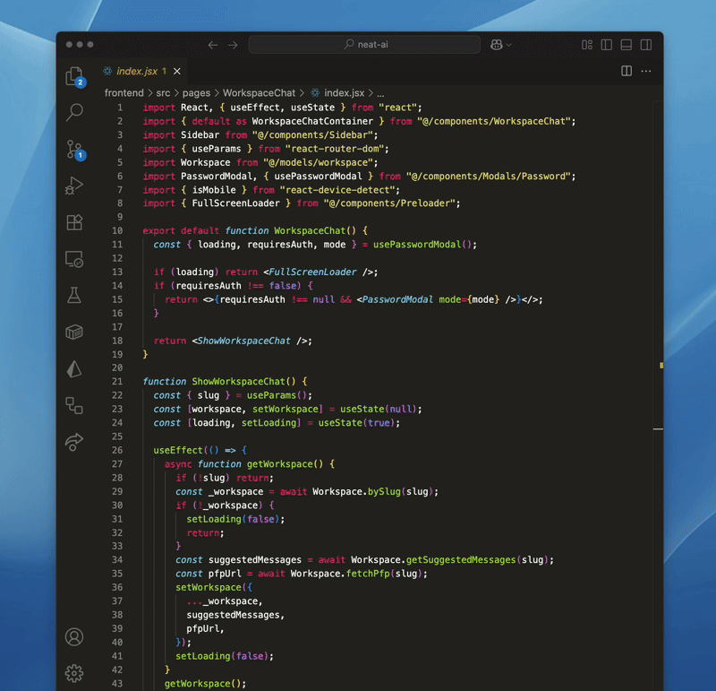
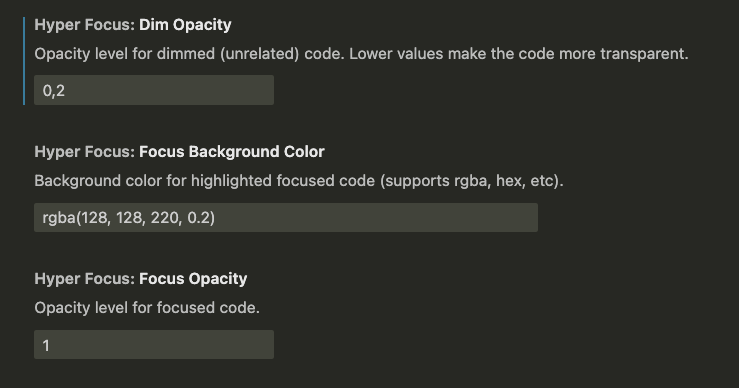

# Hyper Focus - VS Code Extension

A VS Code extension that improves focus while reading code by dimming lines unrelated to the selected symbol.

## Demo

## Settings

## Features

- **Focus Mode**: Dim code unrelated to the symbol under the cursor
- **Quick toggle**: Activate/deactivate with keyboard shortcut
- **Smart highlighting**: Highlights all occurrences of the selected word
- **Full support**: JavaScript, TypeScript, React (JSX/TSX)

## How to Use

1. **Activate Focus Mode**:

   - `Alt + h` (shortcut)
   - Or `Ctrl+Shift+P` → "Toggle Hyper Focus"

2. **Navigate through code**:

   - Click on any variable, function, or symbol
   - The rest of the code will be dimmed
   - Lines with the same symbol remain highlighted

3. **Deactivate**:
   - `Alt + h` again
   - Or run the "Toggle Hyper Focus" command

## License

MIT
